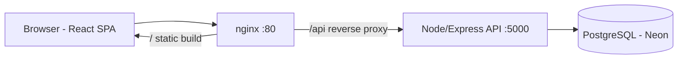

## Architecture

## Tech Stack

| Layer      | Technology                                  |
|------------|---------------------------------------------|
| Backend    | Node.js + Express + TypeScript              |
| Database   | PostgreSQL + Prisma ORM                     |
| Auth       | JWT + bcrypt                                |
| Frontend   | React 18 + Vite + Tailwind CSS v4           |
| PDF        | pdfkit (invoice export)                     |
| Deployment | AWS EC2 + nginx + Neon, Render/Vercel ready |

## Quick Links

- [API Reference](/api-docs) — every endpoint with request/response examples
- [Deployment Guide](/deployment) — local, Neon, AWS EC2, Render/Vercel, CI/CD
- [GitHub Repository](https://github.com/cnniranjan72/Flux) — source code
- [Postman Collection](https://github.com/cnniranjan72/Flux/blob/main/docs/erp-crm.postman_collection.json)

## Test Credentials

All accounts use password **`password123`**:

| Role       | Email               |
|------------|---------------------|
| Admin      | admin@test.com      |
| Sales      | sales@test.com      |
| Warehouse  | warehouse@test.com  |
| Accounts   | accounts@test.com   |
